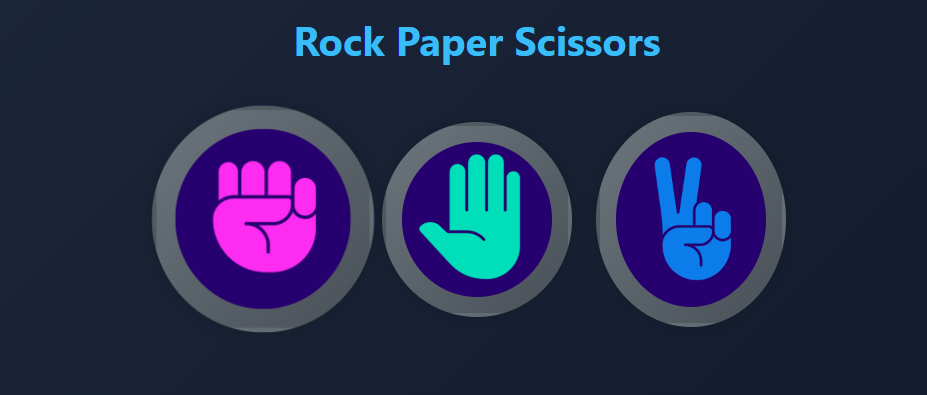

# 🎮 Rock Paper Scissors - Classic Game Reimagined with Modern UI 🎮

Welcome to the **Rock Paper Scissors** game – a timeless classic brought to life using **HTML**, **CSS**, **Bootstrap**, and **JavaScript**. Designed with a modern **dark neon theme**, this project provides a responsive, fun, and visually engaging way to play against the computer.

Perfect for beginner coders, this project demonstrates essential **DOM manipulation**, **event handling**, **responsive design**, and **UI/UX animation techniques** — all wrapped in a compact browser game.

---

## 🌐 Live Preview

🔗 **Play the Game Now**: [Click here to Play Now](https://htmlpreview.github.io/?https://github.com/SHROUDSOURAV/Rock-Paper-Scissors/blob/main/index.html)

---

## 📸 Demo Screenshot

> Add your screenshot here to preview the game UI.



---

## 🧠 How It Works

- The player clicks on one of the three options: **Rock**, **Paper**, or **Scissors**.
- The computer randomly selects one of the three options.
- Game logic determines the winner:
  - Rock crushes Scissors  
  - Scissors cuts Paper  
  - Paper covers Rock
- A real-time score is updated for the player and computer.
- A dynamic message box gives instant feedback:
  - **Win**, **Lose**, or **Draw** – each styled uniquely with animations and colors.

---

## 💡 Features

✅ Intuitive click-based gameplay  
✅ Dynamic score tracking and instant results  
✅ Stylized message box with win/lose/draw effects  
✅ Responsive layout using Bootstrap Flexbox/Grid  
✅ Smooth image scaling and hover transitions  
✅ Custom animations using CSS keyframes  
✅ Fully mobile-friendly and adaptive to screen sizes

---

## 🛠️ Tech Stack

| Technology  | Usage                           |
|-------------|----------------------------------|
| HTML5       | Structure and layout             |
| CSS3        | Custom styles and animations     |
| Bootstrap 5 | Responsive layout and spacing    |
| JavaScript  | Game logic, DOM interaction      |

---

## 🗂️ File Structure

```bash
Rock-Paper-Scissors/
│
├── images/ # Game assets and demo screenshot
│ ├── demo.png # Screenshot for README preview
│ ├── rock.png # Rock hand icon
│ ├── paper.png # Paper hand icon
│ └── scissors.png # Scissors hand icon
│
├── index.html # Main HTML file for the game UI
├── style.css # Custom CSS for styling and animations
├── app.js # JavaScript file containing game logic
└── README.md # Project documentation (you are here)
```

